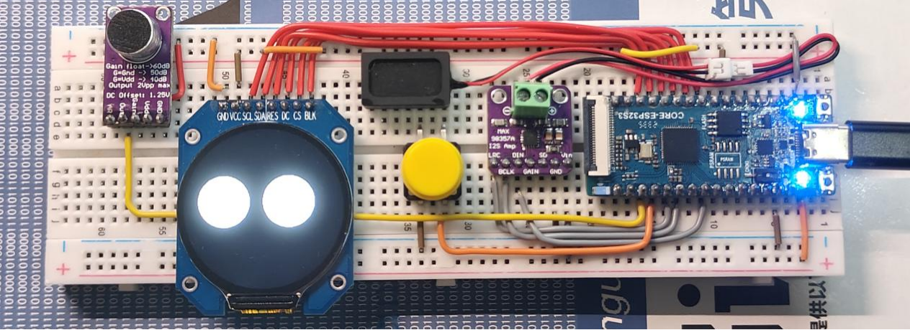

# ChatChatty AI聊天机器人 2024-06-09

## 项目简介
基于ESP32的智能语音聊天机器人，集成以下功能：
- MiniMax语音合成
- MiniMax AI大模型
- 百度语音识别
- Arduino GFX图形显示

详细功能介绍请查看 [项目文档](ChatChatty_AI聊天机器人.docx)。
## 视频演示

## 许可证
本项目采用 [GNU General Public License v3.0](LICENSE) 开源协议。
Copyright © 2025 宁子希